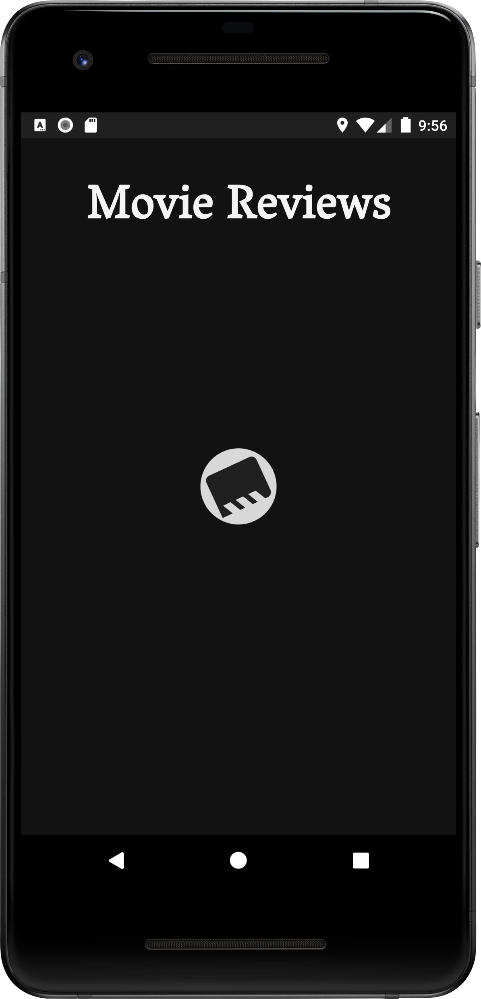

# MovieReviews
My solution of the test task from a company

In project are used:

- Retrofit, Gson, Kotlin Coroutines, Picasso to get, parse and display data from server
- MVVM, Single Activity with two Fragments, Navigation component, View Binding
- RecyclerView, CardView

The task:

Create an application to view a list of movies as a tape

Kotlin language

You should be able to use RecyclerView, libraries for displaying images, libraries for the api requests

The application consists of two screens

Screen 1:

Splash screen with application name and application icon in the center

Screen 2:

RecyclerView with a list of movies.

Each movie should have title, description, picture.

To get the list of movies by api use https://developer.nytimes.com/ - Movie Reviews API

Register on the site, get the key and execute the request:

https://api.nytimes.com/svc/movies/v2/reviews/all.json

Be sure to use loading when scrolling the RecyclerView.

It is advisable to use Retrofit.

 

